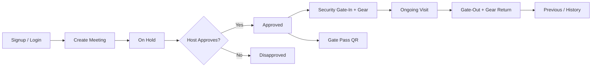

# 01 — Overview

## What this system is

**Visitor Management System (VMS)** for **Nuvoco Vistas Corp Ltd**. It manages:

- Visitor registration and employee (Nuvocan) login
- Meeting requests (individual / group) and host approval
- Security **gate-in / gate-out**, PPE/gear issue & return
- Printable **gate passes** with QR codes
- Blacklist management and live presence status
- Profile and password management for visitors/security

Project display name is set in `db.php` as `Visitor Management System` (`$ProjectName`, `$appURL`).

## Who uses it

| Role | `logType` | Login option (`checkLogin.php`) | Primary experience |
|------|-----------|----------------------------------|--------------------|
| External visitor | `V` | Visitor | Dashboard `index.php`, create meeting via `newmeeting2.php` |
| Nuvoco employee (host) | `E` | Nuvocan | Dashboard + Approvals; must exist in `tbl_nuvo_employee` as Active |
| Security / watchman | `S` | Security | Redirected to `watchman.php` for gate & gear ops |

Session keys (after login): `loginType`, `userDetails`, `loginId`, `profilePic`. Guarded by `header.php`.

## Tech stack

| Layer | Technology |
|-------|------------|
| Backend | Classic PHP + mysqli (no MVC framework) |
| Database | MySQL database `vms` |
| UI | Azia Admin (Bootstrap 4), jQuery, Select2, DataTables |
| Email | PHPMailer → Office 365 SMTP (`emailSMTP.php` → `sent_email()`) |
| QR | phpqrcode (`phpqrcode/`) |
| Images | GD → WebP under `vmsdb/faces/` and related upload paths |
| Build (theme) | Gulp / npm (`package.json` — Azia template deps) |

Front-end pages call JSON/HTML backends under `vmsdb/` (often with hardcoded production URLs).

## End-to-end lifecycle

## Out of scope / leftovers

- `Star-VMS/` — Azia template copy, not the live app
- Root `*.html` demos (`elem-*.html`, `form-elements.html`, etc.) — theme samples
- `README.md` at repo root — still the Azia Admin template readme, not VMS product docs
- Duplicate/experimental pages: `watchman2–4.php`, `watvchman6.php`, `index2backup.php`, `homea.php`, `trial.php`
