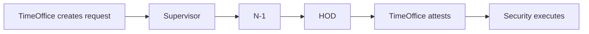

# Late Coming / Early Going Flow — User-Shared Understanding

**Source:** `Late Coming Early Going Flow.docx` (shared 21 July 2026)  
**Related:** [MOM - UI Review 20 July 2026.md](MOM%20-%20UI%20Review%2020%20July%202026.md), [requirment.md](requirment.md)

---

## 1. Application naming & architecture

| Item | Decision |
|------|----------|
| Terminology | **Contract Labour** → **Workman** |
| Application title | **Access control for Contract Workman Entry/Exit Pass** |
| Architecture | **Standalone app** — not inside VMS login selector |
| UI reference | Existing **VMS / Azia** design approved for prototype |

---

## 2. Admin dashboard

- Separate views for **IN** and **OUT**
- Default: **today’s data only**
- **Date filter** for historical records
- Admin can manage contractors, approval matrix, users, reports

---

## 3. Approval matrix (master — who approves per plant/dept)

Configure approvers by:

| Field | Notes |
|-------|--------|
| Plant | |
| Department | |
| Supervisor | |
| Head HR | Matrix assignee (re-activation / HR scenarios) |
| N-1 | |
| HOD | |

- Employee picked from **AMS dropdown** (code auto-fills)
- **No Access Type** on this screen

---

## 4. Contractor master

**Mandatory fields:**

| Field |
|-------|
| Vendor Name |
| Contractor Name |
| Email ID |
| Contractor Mobile Number |
| Supervisor (Contact Person) |
| Supervisor Mobile |

**Vendor types:** Supply, Temporary, Measurement — **no Permanent**

- Records: **deactivate only** (never hard delete)
- **Re-activation** requires **Head HR** approval

---

## 5. User roles (Phase 1)

| Role | Purpose |
|------|---------|
| Admin | Masters, users, dashboard |
| N-1 | Approver (2nd in chain) |
| HOD | Approver (final in chain) |
| Time Office | Creates requests on workman’s behalf; attests after approval |
| Security | Gate execution |
| HR Head | Contractor re-activation approval |

> **Note:** Approval **flow** includes **Supervisor** as first step (see §6). Supervisor login/credentials come from Approval Matrix assignment (same as MOM).

**No Contractor login** in Phase 1.

---

## 6. Early Going / Late Coming workflow

### Application creation

1. Workman approaches **Time Office / Security**
2. **Time Office** creates request with:
   - Type: **Early Going** or **Late Coming**
   - **Reason**

### Approval flow

```
Supervisor → N-1 → HOD
```

### Execution flow

1. After all approvals → **Time Office / Security** attests
2. **Security** executes Early Going / Late Coming (gate OUT / IN)



---

## 7. User creation & credentials

- On user create: email **Login ID + default password** (VMS pattern)
- Admin assigns role
- User **should change password on first login** (docx requirement)

---

## 8. Review cadence

- Project review meetings **twice per week**

---

## 9. Reconciliation with MOM (20 July 2026)

| Topic | Docx | MOM | **Build decision** |
|-------|------|-----|-------------------|
| App title | Access control for Contract Workman Entry/Exit Pass | Contract Workman Gate Entry/Exit Pass | Use **docx title** (user doc is later) |
| Approval chain | Supervisor → N-1 → HOD | Supervisor → N-1 → HOD | **Aligned** |
| Matrix includes Head HR | Yes | HR for re-activation only | Store **Head HR in matrix** + re-activation workflow |
| Contractor “Vendor Name” | Vendor Name | Company Name | UI label **Vendor Name**; same field |
| Supervisor in role list | Not listed | Listed as approver | **Supervisor role/login required** for approval step |
| Terminology | Late Coming / Early Going | Late IN / Early Out | UI: **Late Coming / Early Going**; DB enum can use `Late Entry` / `Early Leaving` |
| First-login password change | Yes | Not stated | **Implement** forced change on first login |
| Gate pass module | Not in this doc | Phase 2 separate | **Out of scope** for Phase 1 build |

---

## 10. Phase 2 (not in this document)

Gate Pass Management (Insider/Outsider, 6-month validity) remains a **separate module** per MOM — see [requirment.md](requirment.md) §2–5.
