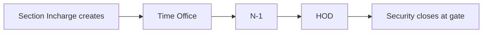

# Late Coming / Early Going Flow — Confirmed Understanding

**Source:** Original docx (21 July 2026) plus process changes confirmed Aug 2026.  
**Related:** [Points.md](Points.md), [MOM - UI Review 20 July 2026.md](MOM%20-%20UI%20Review%2020%20July%202026.md)

> Branding: **LIEO** = Late IN / Early Out. Folder/URL is `/lieo` (legacy `/lieo` redirects). Login is **separate from VMS**.

---

## 1. Application naming & architecture

| Item | Decision |
|------|----------|
| Terminology | **Workman** (not Contract Labour) |
| Application title | Access control for Contract Workman Entry/Exit Pass |
| Architecture | Standalone LIEO app (not VMS login selector) |
| UI | VMS / Azia theme |

---

## 2. Roles

| Role | Scope | Purpose |
|------|--------|---------|
| **Admin** | System | Assign / edit / delete **Time Office** users only; dashboard |
| **Section Incharge** | Department | **Creates** Late IN / Early Out applications |
| **Time Office** | Department | **Approves** after Section Incharge; owns plant masters (matrix, departments, contractors, notification mails) |
| **N-1** | Department | Approver after Time Office |
| **HOD** | Plant (one per plant) | Final approval before gate |
| **Security** | Plant (one per plant) | Closes at gate with **mandatory remark** |
| **HR Head** | Plant (one per plant) | Contractor reactivation decision |

**Supervisor is not an approver.** Contractor Supervisor receives an **information email** only when an application is created.

**No contractor login.**

---

## 3. Approval flow

```
Section Incharge (create)
  → Time Office
  → N-1
  → HOD
  → Security (gate close + remark)
```


```mermaid
flowchart LR
  SI[Section Incharge creates]
  TO[Time Office]
  N1[N-1]
  HOD[HOD]
  Sec[Security closes at gate]
  SI --> TO --> N1 --> HOD --> Sec
```

- Reject at any approval step returns to the **creator** (Section Incharge) by email.
- After HOD approve, Security is notified to close at gate.
- After gate close, creator is notified.

---

## 4. Approval Matrix

### Scope

| Roles | Assigned by | Scoped to |
|-------|-------------|-----------|
| Section Incharge, Time Office, N-1 | See below | **Department** of a plant |
| HOD, Security, HR Head | Time Office | **Plant** (one assignee each) |

### Who maintains it

- **Admin only** assigns Time Office (add / edit / delete). Time Office **cannot** assign another Time Office for other departments.
- **Time Office** assigns Section Incharge, N-1 (department-wise) and HOD, Security, HR Head (plant-wise). Time Office can **add / edit / delete** those assignments.
- Employee picked from **AMS** (code / email auto-fill). First save emails LIEO login + temporary password.

---

## 5. Department master (plant)

- Time Office can **add / update / delete** departments for **their plant**.
- If the plant has departments in this master, **use those** everywhere (matrix, applications).
- If the plant has **no** master departments, **fall back to AMS** departments.
- Data visibility: users of one department see **only that department’s** applications/users (not other departments).

---

## 6. Contractor master

Owned by **Time Office** (moved from Admin).

**Fields:**

- Contractor Name  
- Contractor Email  
- Contractor Mobile Number  
- Contractor Type (Supply / Temporary / Measurement)  
- Supervisor  
- Supervisor Mobile Number  

- Deactivate only (no hard delete).  
- Reactivation: Time Office requests → **HR Head** approves/rejects.

---

## 7. Notification Mail (Time Office only)

- Menu on **Time Office**, not Admin.  
- Heading: **HR Head Contractor Activation Notification**.  
- **Multiple CC emails per plant** (e.g. RCP: `ABC@gmail.com`, `PQR@gmail.com`).  
- When Time Office requests reactivation, until HR Head **approve/reject**:
  - **TO:** HR Head  
  - **CC:** plant notification emails  

---

## 8. Dashboards

Required for **Section Incharge**, **Time Office**, **N-1**, **HOD** (and Admin remains).

Show (as relevant to the role): pending count, created apps, approved / rejected, gate completed. Date filter default = today.

---

## 9. Application tracking

- Status, approval trail, remarks history  
- Filters: plant, department, date, status, workman, contractor  

---

## 10. Emails (application)

| Event | TO | Notes |
|-------|----|--------|
| Application created | Time Office (next approver) | **CC / extra:** contractor **Supervisor** (information only) |
| Time Office / N-1 / HOD approve | Next role in chain | |
| HOD approve | Security | Ready for gate |
| Reject | Section Incharge (creator) | |
| Gate close | Section Incharge (creator) | |

---

## 11. User credentials

- New matrix user: email Login ID + temporary password.  
- Forced change on first login.  
- LIEO password is stored on `tbl_lieo_user` (not VMS `tbl_logindetail`).

---

## 12. Phase 2 (out of scope)

Gate Pass Management (Insider/Outsider) remains a separate module.
